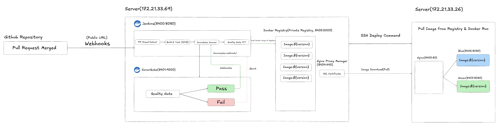

# CI/CD 파이프라인 및 무중단 배포(Blue/Green) 아키텍처

본 프로젝트는 GitHub PR 병합(Merge) 이벤트를 감지하여 소스 코드를 빌드하고, SonarQube를 통한 정적 코드 분석을 거쳐 안전성이 검증된 코드만 Docker 컨테이너로 무중단 배포하는 자동화 파이프라인을 구축했습니다.

## 🏗️ 1. 시스템 아키텍처 (System Architecture)



파이프라인은 크게 빌드를 담당하는 **온프레미스 빌드 서버**와 실제 서비스가 구동되는 **배포 서버**로 물리적으로 분리되어 운영됩니다. 특히 하나의 배포 서버를 여러 팀이 공유하는(Multi-Tenant) 환경의 제약을 고려하여 전용 포트(8400번대)를 할당하여 격리된 환경을 구축했습니다.

### 1.1 빌드 서버 (`172.21.33.69`)
소스 코드 빌드, 테스트, 코드 품질 검사 및 도커 이미지 생성을 담당하는 CI 핵심 서버입니다.
* **Jenkins (Port: 8400):** 파이프라인 전체 오케스트레이션 수행
* **SonarQube (Port: 8401):** 정적 코드 분석 및 Quality Gate 검증

### 1.2 배포 서버 (`172.21.33.26`)
실제 애플리케이션 컨테이너가 구동되는 CD 대상 서버입니다.
* **Nginx (Port: 8405):** 외부 트래픽을 받아 현재 활성화된(Blue/Green) 컨테이너로 포워딩하는 리버스 프록시(Reverse Proxy)
* **Blue 컨테이너 (Port: 8406):** 애플리케이션 실행 환경 1
* **Green 컨테이너 (Port: 8407):** 애플리케이션 실행 환경 2

---

## 🔄 2. 파이프라인 상세 동작 과정

1. **GitHub Webhook 트리거 (PR Closed Detect):** 개발자가 GitHub에서 Pull Request를 Merge(Close)하면, GitHub Webhook이 트리거되어 빌드 서버의 Jenkins로 신호를 보냅니다. (`Generic Webhook Trigger` 사용)
2. **빌드 및 정적 코드 분석 (Build & SonarQube Scanner):** 코드를 체크아웃한 뒤, Gradle을 이용해 프로젝트를 빌드하고 테스트를 수행합니다. 생성된 바이너리와 테스트 커버리지 리포트(Jacoco)를 SonarQube 서버로 전송하여 분석을 요청합니다.
3. **Quality Gate 검증:** SonarQube가 코드 스멜, 버그, 취약점 등을 분석하고 설정된 기준(Quality Gate)을 통과했는지 Webhook을 통해 젠킨스로 회신합니다. 통과하지 못하면(Fail) 파이프라인은 즉시 중단(Abort)됩니다.
4. **Docker 이미지 빌드 및 Push (Google Jib):** 검증을 통과한 코드는 도커 데몬 없이 이미지를 생성하는 **Jib 플러그인**을 활용하여 Private Registry(`aransword.site:8404`)에 푸시됩니다. (버전 관리를 위해 Jenkins `BUILD_NUMBER`를 태그로 사용)
5. **원격 서버 무중단 배포 (Remote Blue-Green Deploy):** Jenkins가 SSH를 통해 배포 서버에 접속하여 배포 스크립트(`deploy.sh`)를 실행합니다.

---

## 🔍 3. 핵심 아키텍처 상세 동작 원리

### 3.1 Jenkins와 SonarQube의 양방향 통신 (Quality Gate)
코드 품질 검사는 단순한 단방향 요청이 아닌, 확실한 피드백 루프(비동기 대기 및 웹훅)를 통해 이루어집니다.

* **① Jenkins → SonarQube (분석 요청):** 젠킨스가 `sh './gradlew sonar'`를 실행해 소스 코드와 커버리지 결과를 압축하여 SonarQube 서버로 POST 요청을 보냅니다.
* **② SonarQube (자체 분석 중):** 수신한 데이터를 백그라운드에서 정적 분석하며 'Pass/Fail' 여부를 판정합니다. 이 동안 젠킨스는 `waitForQualityGate()` 단계에서 분석이 끝날 때까지 대기합니다.
* **③ SonarQube → Jenkins (결과 피드백):** 분석이 끝나면 SonarQube가 젠킨스의 엔드포인트(`/sonarqube-webhook/`)로 결과를 JSON 형태로 발송(Webhook)합니다. 'Fail' 수신 시 젠킨스는 파이프라인을 즉시 강제 중단합니다.

---

## 💡 4. 무중단 배포(Blue/Green) 구축 시 핵심 고려사항 및 트러블슈팅

> 🚨 **더 자세한 트러블슈팅(에러 로그 및 상세 해결 과정)은 [TROUBLESHOOTING.md](https://github.com/jeeneep/cicd-pipeline-playground/blob/main/TROUBLESHOOTING.md) 문서를 참고해 주세요.**

실무 수준의 안정적인 무중단 배포를 구현하기 위해 다음과 같은 기술적 의사결정을 적용했습니다.

* **공유 서버 환경 포트 충돌 방지:** 여러 팀이 사용하는 배포 서버에서 기본 포트 충돌을 막기 위해 팀 전용 포트 대역(8405~8407)을 사용하고, Nginx를 `--network host` 모드로 구동하여 라우팅을 안전하게 구성했습니다.
* **Actuator 기반 정밀 헬스 체크:** 단순한 웹 서버 응답이 아닌, DB 연결 상태 등 종합적인 컨디션을 확인하는 **Spring Boot Actuator**(`/actuator/health`)를 사용하여 완전히 정상인 컨테이너로만 트래픽이 전환되도록 보장합니다.
* **안전한 롤백을 위한 순환 백업 유지:** 배포 시 이전 버전의 컨테이너를 즉시 삭제하지 않고 **중지(Stop)** 상태로 대기시킵니다. 장애 발생 시 별도의 빌드 과정 없이 `docker start` 명령 하나로 즉각적인 롤백이 가능합니다. (새 버전 배포 시 2단계 전의 오래된 컨테이너만 선별 삭제)
* **Docker Image Caching 무시 현상 방지:** `latest` 태그 사용 시 발생하는 이미지 다운로드 누락(캐싱) 문제를 방지하기 위해, 파이프라인에서 생성한 고유 빌드 번호(`${env.BUILD_NUMBER}`)를 배포 스크립트에 파라미터(`$1`)로 전달하여 명시적으로 특정 버전의 이미지를 Pull 하도록 수정했습니다.

---

## 💻 5. 핵심 소스 코드

### 5.1 Jenkinsfile
```groovy
pipeline {
    agent any
    
    triggers {
        GenericTrigger(
            genericVariables: [
                [key: 'PR_ACTION', value: '$.action']
            ],
            token: 'my-pr-close-token',
            regexpFilterText: '$PR_ACTION',
            regexpFilterExpression: '^closed$',
            causeString: 'Triggered by GitHub PR Closed Event'
        )
    }

    stages {
        stage('Checkout') {
            steps {
                checkout scm
            }
        }

        stage('Build & SonarQube Analysis') {
            steps {
                withSonarQubeEnv('SonarQube-Server') {
                    sh 'chmod +x gradlew'
                    sh './gradlew clean build sonar'
                }
            }
        }

        stage('Quality Gate') {
            steps {
                timeout(time: 5, unit: 'MINUTES') {
                    waitForQualityGate abortPipeline: true
                }
            }
        }

        stage('Docker Build & Push (Jib)') {
            steps {
                withCredentials([usernamePassword(credentialsId: 'registry-auth',
                                                  passwordVariable: 'REGISTRY_PASSWORD',
                                                  usernameVariable: 'REGISTRY_USERNAME')]) {
                    script {
                        sh './gradlew jib -x test -Djib.to.auth.username=${REGISTRY_USERNAME} -Djib.to.auth.password=${REGISTRY_PASSWORD} --stacktrace --info'
                    }
                }
            }
        }

        stage('Remote Blue-Green Deploy') {
            steps {
                sshagent(credentials: ['front-com-key']) {
                    script {
                        def remoteServer = "sw_team_5@172.21.33.26"
                        def imageTag = "${env.BUILD_NUMBER}"

                        sh """
                            ssh -o StrictHostKeyChecking=no ${remoteServer} '
                                chmod +x /home/sw_team_5/deploy.sh &&
                                /home/sw_team_5/deploy.sh ${imageTag}
                            '
                        """
                    }
                }
            }
        }
    }
}
```

### 5.2 build.gradle (핵심 설정 추출)
```gradle
plugins {
    id 'java'
    id 'org.springframework.boot' version '3.2.5'
    id "org.sonarqube" version "5.1.0.4882"
    id 'jacoco'
    id 'com.google.cloud.tools.jib' version '3.4.1'
}

def buildNumber = System.getenv('BUILD_NUMBER') ?: 'latest'

jib {
    from { image = 'eclipse-temurin:17-jre-alpine' }
    to {
        image = 'aransword.site:8404/cicd-pipeline-playground'
        tags = [buildNumber, 'latest'].unique()
    }
    container { ports = ['8080'] }
}

sonar {
    properties {
        property "sonar.projectKey", "sw_team_5" 
        property "sonar.projectName", "sw_team_5"
        property "sonar.coverage.jacoco.xmlReportPaths", "build/reports/jacoco/test/jacocoTestReport.xml"
    }
}

dependencies {
    implementation 'org.springframework.boot:spring-boot-starter-actuator'
    // ... 생략 ...
}
```

### 5.3 무중단 배포 스크립트 (배포 서버: `~/deploy.sh`)
```bash
#!/bin/bash

# 1. 버전 및 포트 설정
# 실행 시 전달받은 첫 번째 인자($1)를 버전으로 사용합니다. (예: ./deploy.sh v1.0.1)
TARGET_VERSION=$1

# 버전 인자가 없을 경우를 대비한 안전장치
if [ -z "${TARGET_VERSION}" ]; then
    echo "=> [에러] 배포할 버전(TAG)이 지정되지 않았습니다. (Usage: ./deploy.sh [VERSION])"
    exit 1
fi

CURRENT_PORT=$(cat ~/nginx-conf/service-url.inc | grep -Po '[0-9]+' | tail -1)
TARGET_PORT=0
# 전달받은 버전을 이미지 주소에 반영합니다.
IMAGE_URL="aransword.site:8404/cicd-pipeline-playground:${TARGET_VERSION}"

if [ ${CURRENT_PORT} -eq 8406 ]; then
    TARGET_PORT=8407
    TARGET_COLOR="green"
    CURRENT_COLOR="blue"
else
    TARGET_PORT=8406
    TARGET_COLOR="blue"
    CURRENT_COLOR="green"
fi

echo "=> 현재 운영 중: ${CURRENT_COLOR} (${CURRENT_PORT})"
echo "=> 배포 대상 버전: ${TARGET_VERSION} (${TARGET_COLOR}:${TARGET_PORT})"

# 2. 이미지 사전 Pull
echo "=> 레지스트리에서 이미지를 가져옵니다: ${IMAGE_URL}"
docker pull ${IMAGE_URL}

# 3. 오래된 백업 컨테이너 삭제
if [ $(docker ps -a -q -f name=sw_team_5_app-${TARGET_COLOR}) ]; then
    echo "=> 오래된 백업 컨테이너(sw_team_5_app-${TARGET_COLOR})를 정리합니다."
    docker stop sw_team_5_app-${TARGET_COLOR}
    docker rm sw_team_5_app-${TARGET_COLOR}
fi

# 4. 새 컨테이너 실행
echo "=> 새 버전(${TARGET_COLOR}) 컨테이너를 실행합니다."
docker run -d \
  --name sw_team_5_app-${TARGET_COLOR} \
  --restart always \
  -p ${TARGET_PORT}:8080 \
  -e TZ=Asia/Seoul \
  ${IMAGE_URL}

# 5. 헬스 체크 (Actuator)
echo "=> 헬스 체크 시작 (포트: ${TARGET_PORT})..."
sleep 15 

for RETRY_COUNT in {1..10}
do
    RESPONSE=$(curl -s http://127.0.0.1:${TARGET_PORT}/actuator/health)
    UP_COUNT=$(echo ${RESPONSE} | grep 'UP' | wc -l)

    if [ ${UP_COUNT} -ge 1 ]; then
        echo "=> 헬스 체크 성공!"
        break
    else
        echo "=> 헬스 체크 응답 대기 중... (${RETRY_COUNT}/10)"
        sleep 5
    fi

    if [ ${RETRY_COUNT} -eq 10 ]; then
        echo "=> [에러] 헬스 체크 실패. 배포를 중단하고 새로 띄운 컨테이너를 삭제합니다."
        docker stop sw_team_5_app-${TARGET_COLOR}
        docker rm sw_team_5_app-${TARGET_COLOR}
        exit 1
    fi
done

# 6. Nginx 트래픽 전환
echo "=> Nginx 트래픽을 ${TARGET_PORT}로 스위칭합니다."
echo "set \$service_url http://172.21.33.26:${TARGET_PORT};" > ~/nginx-conf/service-url.inc
docker exec nginx-sw-team5 nginx -s reload

# 7. 이전 버전 컨테이너 중지 (백업용 유지)
if [ $(docker ps -q -f name=sw_team_5_app-${CURRENT_COLOR}) ]; then
    echo "=> 이전 버전(${CURRENT_COLOR})을 중지하고 백업으로 보관합니다."
    docker stop sw_team_5_app-${CURRENT_COLOR}
fi

echo "=> [성공] 배포 완료! 버전: ${TARGET_VERSION}, 포트: ${TARGET_PORT}"
```